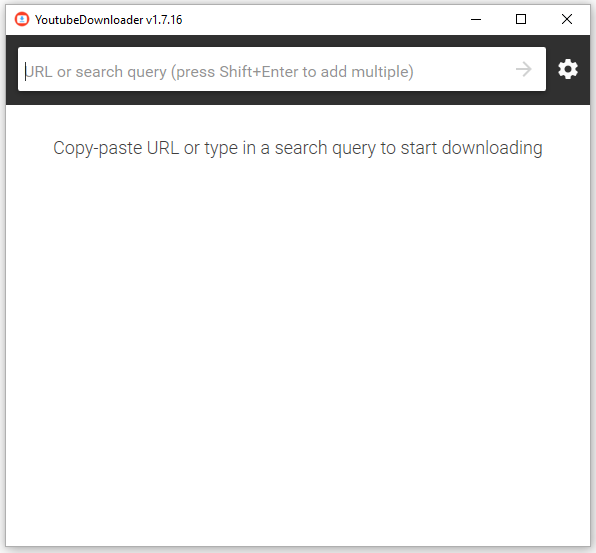

# Quick Instructions
## Download
- Download the YoutubeDownloader: https://github.com/TheRealEnigma/YoutubeDownloader/releases/download/1.7.16.RE/YoutubeDownloader.zip
- Unzip.
- Remove it simply by deleting it.
- Requires .NET v3.1 Desktop Runtime, which you can [download here](https://dotnet.microsoft.com/download/dotnet-core/3.1).
- Runs on Windows, Mac, Linux, Pis, etc. 

## Running
- Run YoutubeDownloader.exe from wherever it was unzipped.

- Paste a YouTube URL (video or playlist) and click download to save to your location of choice.

## Settings
- Numerous settings allow you to select the format, audio only, etc. Normally the defaults for video are adequate.

## Issues & Other Feedback
Post any issues and other feedback using the "Discussions" tab.

## Additional info
Original author's (Tyrrrz) readme follows. The donate button goes to him, not me.
# YoutubeDownloader

**Project status: maintenance mode** (bug fixes only).

YoutubeDownloader is an application that lets you download videos from YouTube. You can copy-paste URL of any video, playlist or channel and download it directly to a format of your choice. It also supports searching by keywords, which is helpful if you want to quickly look up and download videos.

This application uses [YoutubeExplode](https://github.com/Tyrrrz/YoutubeExplode) under the hood to interact with YouTube.

## Download

- **[Latest release](https://github.com/Tyrrrz/YoutubeDownloader/releases/latest)**
- [CI build](https://github.com/Tyrrrz/YoutubeDownloader/actions)

Note: This application requires .NET v3.1 Desktop Runtime, which you can [download here](https://dotnet.microsoft.com/download/dotnet/3.1/runtime).

## Features

- Supports single videos, playlists, channels, and search queries
- Variety of output formats: mp4, webm, mp3, ogg
- Selectable video quality
- Multiple downloads in parallel with progress reporting and cancellation
- Automatic media tagging for audio downloads

## Screenshots

